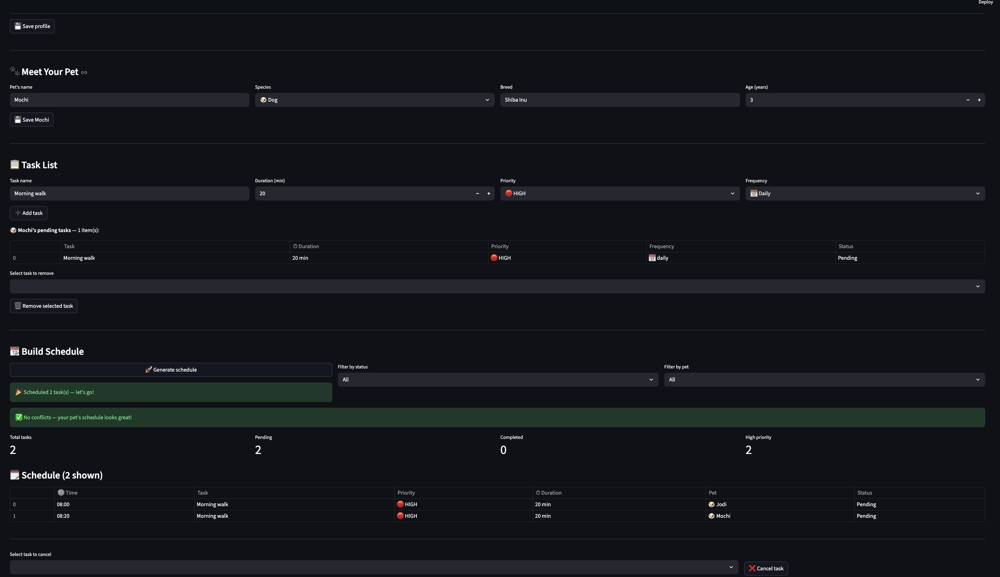

# PawPal+ 🐾

**PawPal+** is a Streamlit app that helps busy pet owners stay consistent with their pet's care routine. Enter your availability, add your pet and their tasks, and PawPal+ builds an optimized daily schedule — complete with conflict warnings, smart sorting, and automatic recurrence.

---

## Features

### 1. Priority-Based Scheduling
The scheduler uses a **greedy first-fit algorithm** to assign tasks to your available time windows. Tasks are ranked HIGH → MEDIUM → LOW priority first, then by shortest duration within each tier, ensuring the most important care happens first and your time is used efficiently.

### 2. Sorting by Time
All scheduled tasks are displayed in **chronological order** using a time-aware sort. Each `"HH:MM"` string is parsed into a numeric `(hours, minutes)` tuple before comparison, so `"9:00"` correctly sorts before `"10:00"` — something a plain string sort would get wrong. Tasks with no assigned time slot are placed at the end of the list.

### 3. Filtering
The schedule view supports **live filtering** by status (`pending`, `complete`, `cancelled`) and by pet name. Filters are cumulative — selecting both a status and a pet returns only tasks that satisfy both conditions. Omitting either filter shows all matching tasks.

### 4. Conflict Warnings
After generating a schedule, PawPal+ automatically **scans all pending tasks** across every pet for time slot collisions. Any two tasks sharing the same `scheduled_time` are flagged with a visible warning banner. Warnings are surfaced in the UI and never crash the app — the rest of the schedule is always shown.

### 5. Daily & Weekly Recurrence
Marking a task complete with a `daily` or `weekly` frequency **automatically creates the next occurrence**. The new task inherits the same title, duration, priority, and scheduled time, and is assigned a `due_date` of today + 1 day (daily) or today + 7 days (weekly). Tasks marked `as-needed` are completed without recurrence.

### 6. Schedule Metrics
The schedule view displays a **live metrics row** showing total tasks, pending count, completed count, and high-priority count — giving an at-a-glance summary before diving into the full table.

### 7. Task Management
- Add tasks with a title, duration, priority, and frequency
- Duplicate task names on the same pet are blocked with a warning
- Remove pending tasks from a pet's list at any time
- Cancel scheduled tasks directly from the schedule view

---

## 📸 Demo

<a href="docs/pawpal_demo.png" target="_blank"></a>

---

## Getting started

### Setup

```bash
python -m venv .venv
source .venv/bin/activate  # Windows: .venv\Scripts\activate
pip install -r requirements.txt
```

### Suggested workflow

1. Read the scenario carefully and identify requirements and edge cases.
2. Draft a UML diagram (classes, attributes, methods, relationships).
3. Convert UML into Python class stubs (no logic yet).
4. Implement scheduling logic in small increments.
5. Add tests to verify key behaviors.
6. Connect your logic to the Streamlit UI in `app.py`.
7. Refine UML so it matches what you actually built.

## Testing PawPal+

### Running the tests

```bash
python -m pytest tests/test_pawpal.py -v
```

### What the tests cover

The suite contains **63 tests** organized across five test classes:

| Class | Tests | What it covers |
|---|---|---|
| `TestTask` | 11 | State transitions (`pending` → `complete` → `cancelled`), idempotent operations, zero/large durations |
| `TestPet` | 9 | Adding/removing tasks, `get_pending_tasks()` filtering, independent task lists across pets |
| `TestOwner` | 8 | Adding/removing pets, schedule aggregation across multiple pets |
| `TestScheduler` | 12 | Priority sorting (HIGH → MEDIUM → LOW, shortest-first tie-break), schedule generation, window overflow, cancellation |
| `TestSortingCorrectness` | 6 | Chronological ordering, numeric vs. lexicographic time comparison (`"09:00"` < `"10:00"`), `None` scheduled times, list immutability |
| `TestRecurrenceLogic` | 8 | Daily (+1 day) and weekly (+7 day) due dates, property inheritance on new task, `as-needed` produces no recurrence, no duplicate tasks on repeated completion |
| `TestConflictDetection` | 9 | Same-pet and cross-pet conflicts, three-way collisions in one warning, completed/unscheduled tasks excluded, empty owner |

### Confidence Level

★★★★☆ (4 / 5)

The core scheduling loop, recurrence logic, conflict detection, and all documented edge cases are fully tested and passing. One star is held back because tasks can collide silently when two pets share a task title (the scheduler matches the first one found), and `generate_schedule()` silently skips tasks that exceed every availability window rather than surfacing a warning. Both are observable behaviors worth adding assertions for before shipping to production.
