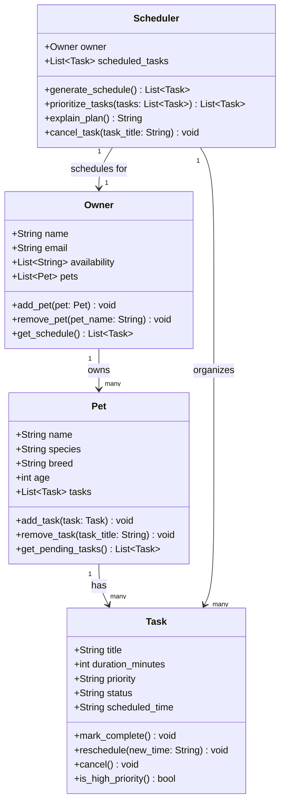

# PawPal+ Project Reflection

## 1. System Design

**a. Initial design**

- Briefly describe your initial UML design.
- What classes did you include, and what responsibilities did you assign to each?

A user should be able to add a new pet with the required information.

A user should be able to see their curated schedule that alligns with their availabilty.

A user should be able to cancel appointments or rescedule an upcoming tasks if something comes up unexpectedly.

**UML Class Diagram:**

**b. Design changes**

- Did your design change during implementation?
- If yes, describe at least one change and why you made it.

Yes, the design changed during implementation. In the initial UML, `Owner` had a `get_schedule()` method that was meant to return the full plan for the day. However, when building the skeleton, it became clear that `Scheduler` was already responsible for generating and organizing the schedule — so both classes were doing the same job. To fix this, the responsibilities were split: `Owner.get_schedule()` was kept as a simple data aggregator that flattens all tasks across all pets into one list, while `Scheduler.generate_schedule()` handles the actual ordering and prioritization logic. This separation follows the Single Responsibility Principle — each class has one clear job rather than sharing overlapping behavior.

---

## 2. Scheduling Logic and Tradeoffs

**a. Constraints and priorities**

- What constraints does your scheduler consider (for example: time, priority, preferences)?
- How did you decide which constraints mattered most?

**b. Tradeoffs**

`generate_schedule()` uses a **greedy first-fit** strategy: tasks are sorted by priority and duration, then each one is assigned to the earliest availability window it fits in — no backtracking, no rearranging.

The tradeoff is **speed vs. optimality**. A greedy pass runs in O(tasks × windows), which is fast and easy to follow. The cost is that it can leave gaps a smarter algorithm would fill. For example, if a 45-minute HIGH priority task doesn't fit in the morning window (only 30 minutes left), it gets pushed to the next window — even if swapping it with two shorter LOW priority tasks would have made everything fit. The schedule produced is *good*, not *optimal*.

This is a reasonable tradeoff for a pet care app because the number of tasks and windows is always small (a typical day might have 5–10 tasks across 3 time windows). The performance difference between greedy and an exhaustive search is irrelevant at that scale, and the simpler algorithm is much easier to debug and explain to a user. If the app scaled to a veterinary clinic scheduling dozens of appointments, a more sophisticated algorithm (e.g., dynamic programming or constraint satisfaction) would be worth the added complexity.

---

## 3. AI Collaboration

**a. How you used AI**

- How did you use AI tools during this project (for example: design brainstorming, debugging, refactoring)?
- What kinds of prompts or questions were most helpful?

**b. Judgment and verification**

- Describe one moment where you did not accept an AI suggestion as-is.
- How did you evaluate or verify what the AI suggested?

---

## 4. Testing and Verification

**a. What you tested**

- What behaviors did you test?
- Why were these tests important?

**b. Confidence**

- How confident are you that your scheduler works correctly?
- What edge cases would you test next if you had more time?

---

## 5. Reflection

**a. What went well**

- What part of this project are you most satisfied with?

**b. What you would improve**

- If you had another iteration, what would you improve or redesign?

**c. Key takeaway**

- What is one important thing you learned about designing systems or working with AI on this project?
