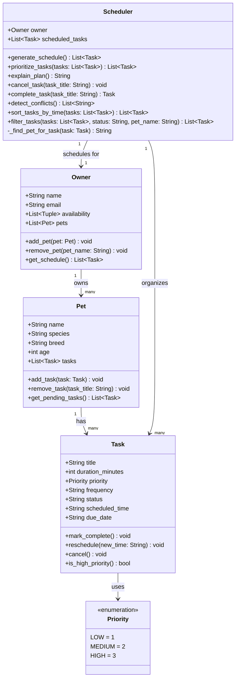

# PawPal+ Project Reflection

## 1. System Design

**a. Initial design**

- Briefly describe your initial UML design.
- What classes did you include, and what responsibilities did you assign to each?

A user should be able to add a new pet with the required information.

A user should be able to see their curated schedule that alligns with their availabilty.

A user should be able to cancel appointments or rescedule an upcoming tasks if something comes up unexpectedly.

**UML Class Diagram:**

**b. Design changes**

- Did your design change during implementation?
- If yes, describe at least one change and why you made it.

Yes, the design changed during implementation. In the initial UML, `Owner` had a `get_schedule()` method that was meant to return the full plan for the day. However, when building the skeleton, it became clear that `Scheduler` was already responsible for generating and organizing the schedule — so both classes were doing the same job. To fix this, the responsibilities were split: `Owner.get_schedule()` was kept as a simple data aggregator that flattens all tasks across all pets into one list, while `Scheduler.generate_schedule()` handles the actual ordering and prioritization logic. This separation follows the Single Responsibility Principle — each class has one clear job rather than sharing overlapping behavior.

---

## 2. Scheduling Logic and Tradeoffs

**a. Constraints and priorities**

- What constraints does your scheduler consider (for example: time, priority, preferences)?

The constraints that my scheduler considers is priority, duration/time window, and owner availability. 

- How did you decide which constraints mattered most?

Priority was decided to matter most because it maps directly to pet welfare. Window capacity came second because violating it would produce a logically broken schedule.

**b. Tradeoffs**

`generate_schedule()` uses a **greedy first-fit** strategy: tasks are sorted by priority and duration, then each one is assigned to the earliest availability window it fits in — no backtracking, no rearranging.

The tradeoff is **speed vs. optimality**. A greedy pass runs in O(tasks × windows), which is fast and easy to follow. The cost is that it can leave gaps a smarter algorithm would fill. For example, if a 45-minute HIGH priority task doesn't fit in the morning window (only 30 minutes left), it gets pushed to the next window — even if swapping it with two shorter LOW priority tasks would have made everything fit. The schedule produced is *good*, not *optimal*.

This is a reasonable tradeoff for a pet care app because the number of tasks and windows is always small (a typical day might have 5–10 tasks across 3 time windows). The performance difference between greedy and an exhaustive search is irrelevant at that scale, and the simpler algorithm is much easier to debug and explain to a user. If the app scaled to a veterinary clinic scheduling dozens of appointments, a more sophisticated algorithm (e.g., dynamic programming or constraint satisfaction) would be worth the added complexity.

---

## 3. AI Collaboration

**a. How you used AI**

- How did you use AI tools during this project (for example: design brainstorming, debugging, refactoring)?

I used AI in 3 different ways. I used it to brainstorm a design, generate a skeleton, and generate tests to validate the code in my program.

- What kinds of prompts or questions were most helpful?

The most useful prompts were specific and scoped: asking about one method at a time with concrete inputs/outputs produced far better results than broad requests like "write tests for the whole system."

**b. Judgment and verification**

- Describe one moment where you did not accept an AI suggestion as-is.
- How did you evaluate or verify what the AI suggested?

When AI generated the sort_tasks_by_time method, the first suggestion used plain string comparison: sorted(tasks, key=lambda t: t.scheduled_time or "99:99"). This looks reasonable at first glance, but string comparison fails for single-digit hours — "9:00" > "10:00" lexicographically even though 9 AM comes first.

The issue was caught by writing the test test_single_digit_hour_sorts_before_two_digit_hour manually first, then running it — it failed with the string-based version. The fix was to parse the time into a numeric tuple (int(h), int(m)) before comparing, which is what the final code uses. This was a good example of writing the test before trusting the implementation.

---

## 4. Testing and Verification

**a. What you tested**

- What behaviors did you test?
- Why were these tests important?

The test suite covers five areas: Task state transitions (mark_complete, cancel, reschedule), Pet task management including independent task lists between pets, Owner aggregation via get_schedule(), and the core Scheduler logic for priority ordering, window-fit checking, and mutation safety on the availability list. The three more advanced features — recurrence, sorting, and conflict detection — each got their own dedicated test class. These tests mattered because several methods have side effects that cross object boundaries; for example, cancel_task needs to update both scheduled_tasks and the pet's own task list simultaneously, and without testing both sides, a partial implementation would silently pass.

**b. Confidence**

- How confident are you that your scheduler works correctly?
- What edge cases would you test next if you had more time?

Confidence is high for the happy path and the edge cases explicitly covered by the 50+ tests, which include status transitions, window overflow prevention, cross-pet conflict detection, recurrence property inheritance, and sort stability. If given more time, the next cases to test would be tasks with identical titles on different pets (since cancel_task and complete_task both stop at the first match), overlapping availability windows in real time, and rescheduling a task that is already in the generated schedule — since calling reschedule() directly updates the task's time but does not re-sort or re-validate the plan.

---

## 5. Reflection

**a. What went well**

- What part of this project are you most satisfied with?

The most satisfying part was how cleanly the data classes and logic classes stayed separated. Using @dataclass for Task and Pet kept them free of business logic, which made them straightforward to test in isolation, and the Scheduler ended up as a cohesive class where every method has a single, clearly defined job that directly maps to a test class.

**b. What you would improve**

- If you had another iteration, what would you improve or redesign?

The biggest redesign would be the conflict detection model — right now it flags any two tasks sharing an exact scheduled_time string, but it should instead check for overlapping time intervals using actual start and end times, which is a more accurate and useful definition of a conflict. A secondary improvement would be replacing the string "HH:MM" format throughout with datetime.time objects, which would eliminate manual string parsing in sort_tasks_by_time and remove an entire category of potential formatting errors.

**c. Key takeaway**

- What is one important thing you learned about designing systems or working with AI on this project?

The most important thing learned was that AI is best used as a first draft rather than a final answer, especially for logic that involves edge cases. The sorting bug — using string comparison instead of numeric tuple comparison for times — looked completely correct on a quick read, and only the test caught it. Writing the test first to describe exactly what the code should do, then generating the implementation, then running the test, was the workflow that consistently produced reliable results.